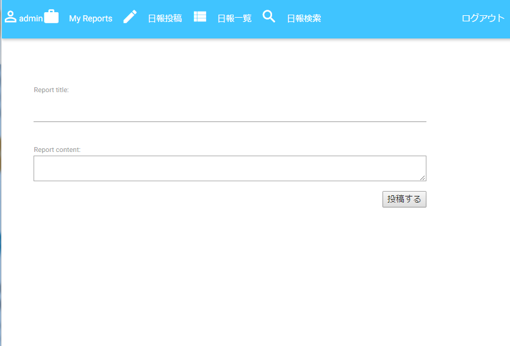
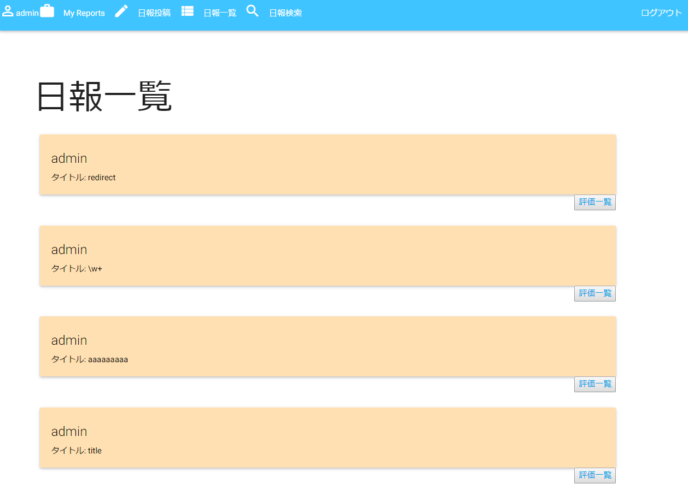
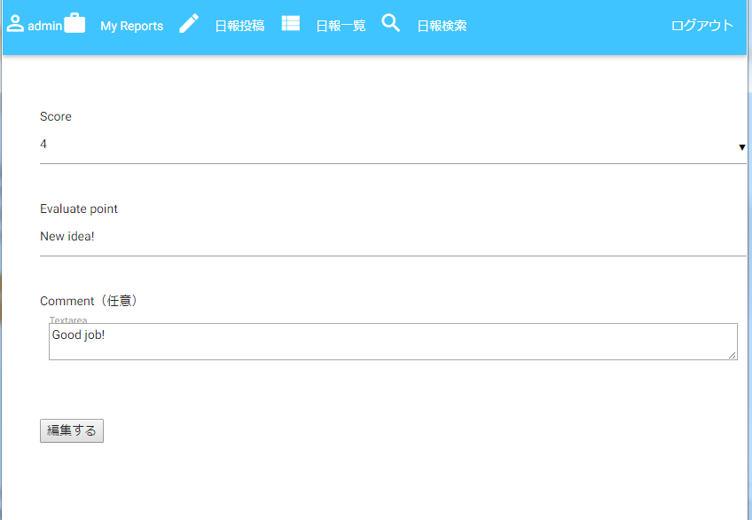

# にっぽうくん
## 概要
「日報は投稿して終わりじゃない！フィードバックをもらってこそ！」をテーマにした日報アプリです。
日報を投稿するのはもちろん、読者が読んだ日報を評価する機能を実装しています。

## デモ
日報作成

日報一覧(色がついている投稿が自身の投稿)

日報採点

## Requirements
Python 3.5

PostgreSQL 9.6

## SetUp

#### データベースの作成
PostgreSQLでユーザ作成を行う。

create user 'ユーザー名';

alter role ユーザー名 with password 'パスワード';

create database 'データベース名' owner 'ユーザー名';

#### 作成したデータベースの情報をsecret.pyに以下のように記述し、setting.pyと同じ階層に記述する。ユーザ名とパスワードは使用するデータベース作成時に登録したものを記述

db_user = 'ユーザ名'

db_pass = 'パスワード'

db_host = 'localhost'

db_port = '5432'

#### SECRET_KEYをsecret.pyに以下のように記述
secret_key = 'シークレットキーにする情報（他人から推測されない文字列）'

#### Djangoのセットアップ
manage.pyのある階層に移動し、以下の順で実行する

  1.python manage.py makemigrations

  2.python manage.py migrate

  3.管理者を作成する場合、python manage.py createsuperuser

#### Djangoの起動
manage.pyのある階層に移動し、以下を実行する

python manage.py runserver

## License
MIT

## Author
KIKUYA-Takumi
