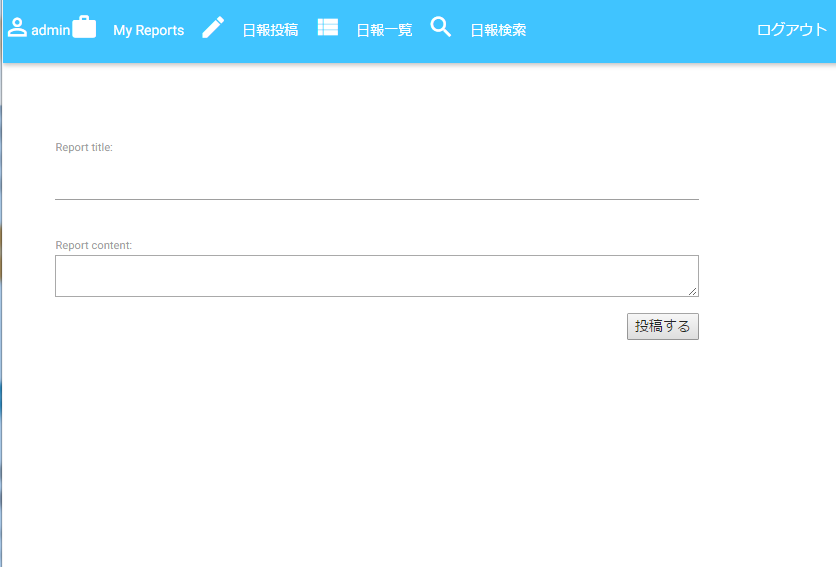
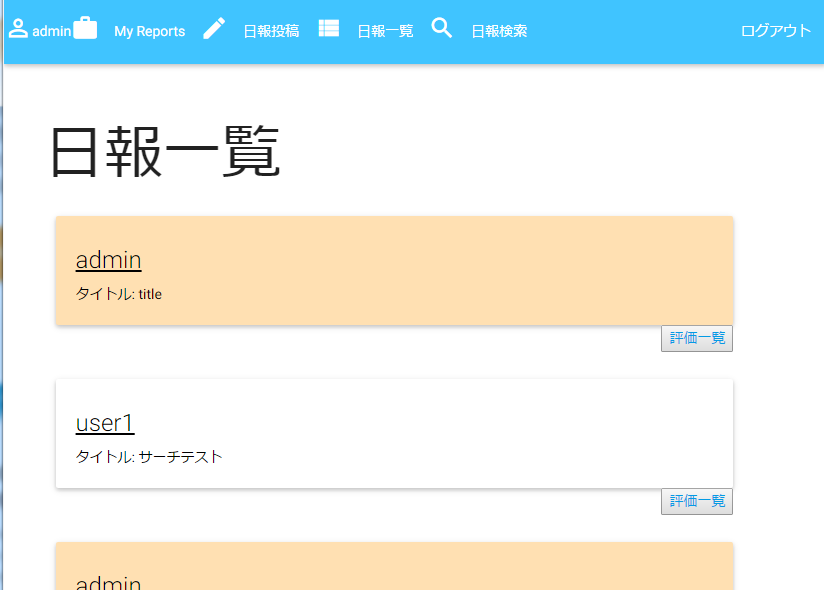
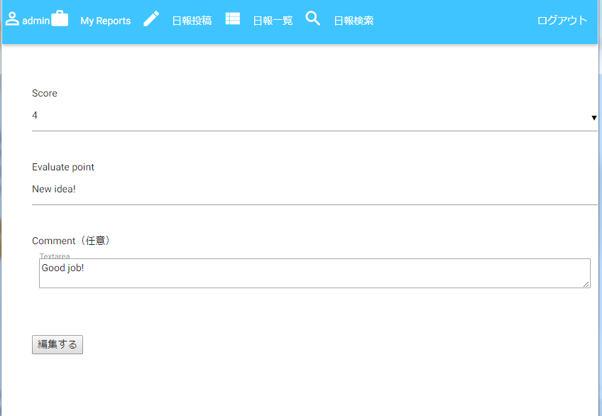

#にっぽうくん
###概要
「日報は投稿して終わりじゃない！フィードバックをもらってこそ！」をテーマにした日報アプリです。
日報を投稿するのはもちろん、読者が読んだ日報を評価する機能を実装しています。

###デモ
日報作成

日報一覧(色がついている投稿が自身の投稿)

日報採点

###Requirements
Python 3.5

PostgreSQL 9.6

Materialize 0.97.6

###License
MIT

###Author
KIKUYA-Takumi